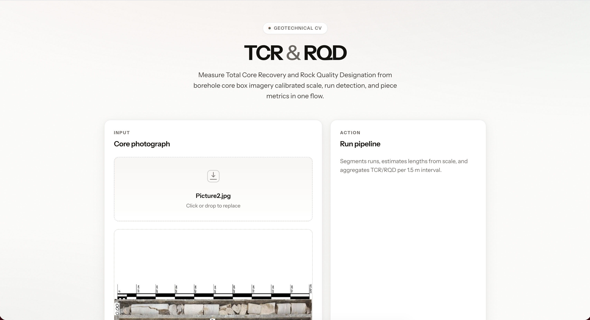
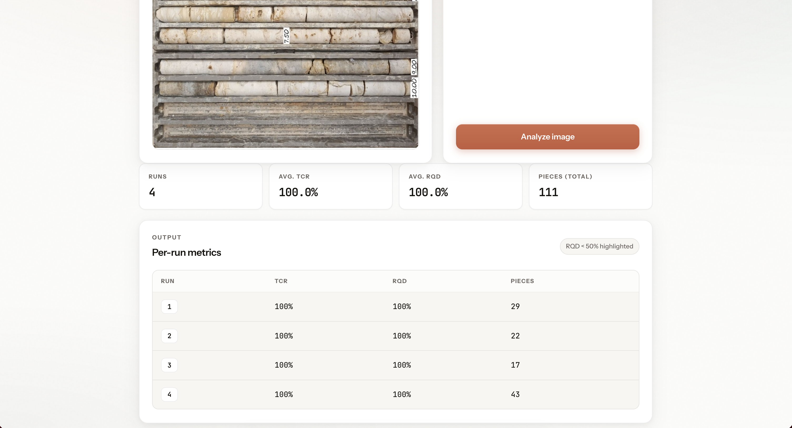
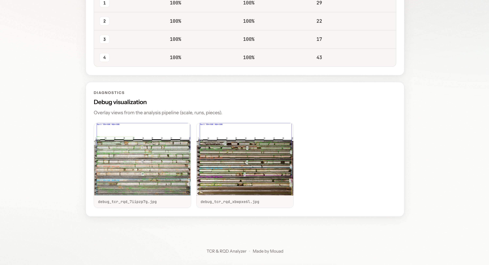

# TCR & RQD Analyzer

Computer vision workflow for **geotechnical core logging**: upload a photo of a borehole **core box**, and get **Total Core Recovery (TCR)** and **Rock Quality Designation (RQD)** per **run** (1.5 m intervals), with optional **debug overlays** to verify detections.

---

## Concept

### What are TCR and RQD?

- **TCR (Total Core Recovery)** — Percentage of the run length represented by all recovered core (solid material), relative to the nominal run (here **150 cm** per run).
- **RQD (Rock Quality Designation)** — Percentage of the run length that counts as “sound” core for RQD rules: pieces **≥ 10 cm** (standard threshold in this pipeline), summed and capped by the same run length.

Together they summarize how much material was recovered and how much of it meets RQD criteria—useful for rock-mass classification and QA/QC on drill core photos.

### What the pipeline does

1. **Scale / tray** — Estimates pixels-per-cm from the tray width (or a fixed calibration).
2. **Run detection** — Finds horizontal bands (runs) along the box.
3. **Piece detection & splitting** — Finds core segments, splits pieces at fractures where needed, converts pixel widths to **lengths in cm**.
4. **Per-run metrics** — Aggregates lengths per run and computes **TCR %** and **RQD %** for each run.

The implementation lives in [`colab.py`](colab.py) (`compute_tcr_rqd(image_path, debug=False)`). A **FastAPI** service ([`api/server.py`](api/server.py)) calls it for the web UI; [`tcr_utils.py`](tcr_utils.py) normalizes results for both the API and Streamlit.

---

## Demo (UI)

### 1. Upload & run the pipeline

Upload a core box image, then run analysis. The UI explains the flow: calibrated scale, run detection, and per-interval TCR/RQD.



### 2. Results dashboard

Summary stats (runs, average TCR/RQD, piece count) and a **per-run table**. Rows with **RQD &lt; 50%** are highlighted for quick review.



### 3. Debug visualization

With **debug** enabled, overlay images show how runs and pieces were detected—useful to validate the model against the photo.



---

## Stack

| Layer | Technology |
|--------|------------|
| Core CV | Python, OpenCV, NumPy, SciPy ([`colab.py`](colab.py)) |
| REST API | FastAPI + Uvicorn ([`api/server.py`](api/server.py)) |
| Web UI | React + TypeScript + Vite ([`web/`](web/)) |
| Optional UI | Streamlit ([`app.py`](app.py)) |

---

## Quick start

### 1. Python environment

```bash
cd TCR-RQD-Computer-Vision-Test   # or your clone path
pip install -r requirements.txt
```

Ensure **OpenCV** is available (`opencv-python-headless` is listed in [`requirements.txt`](requirements.txt); NumPy is pinned for compatibility with SciPy on many systems).

### 2. API (backend)

From the project root:

```bash
uvicorn api.server:app --reload --host 127.0.0.1 --port 8000
```

### 3. Web frontend

```bash
cd web
npm install
npm run dev
```

Open **http://localhost:5173** — the dev server proxies `/api` to the API on port **8000**.

For a production build, set `VITE_API_URL` to your API origin if the UI is not served from the same host.

### 4. Streamlit (alternative)

```bash
streamlit run app.py
```

---

## Repository

**https://github.com/Mouad-Lembarek/TCR-RQD-Computer-Vision-Test**

---

## Notes

- Results depend on image quality, lighting, and how clearly the tray and core are visible. Use **debug** images to confirm segmentation before relying on numbers for critical decisions.
- This project is intended for **review and demo** workflows; field workflows may require calibration checks and manual QC.
